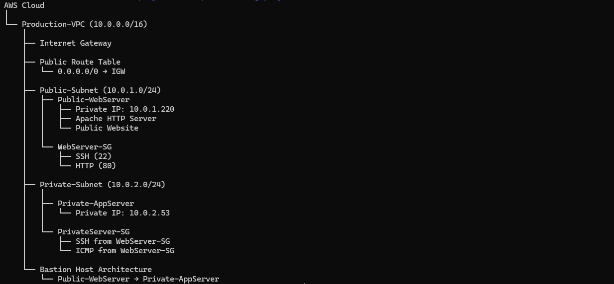
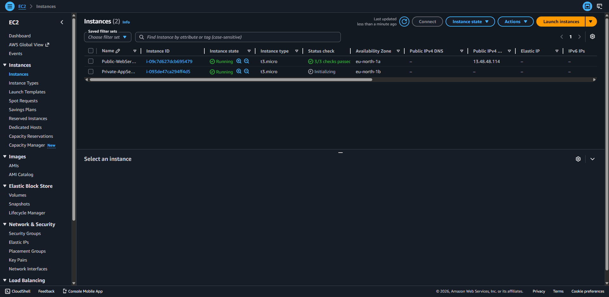
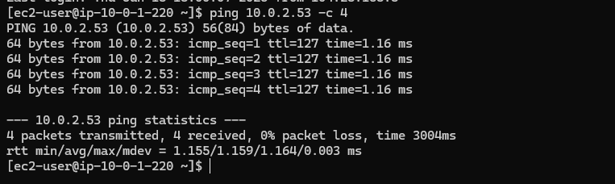
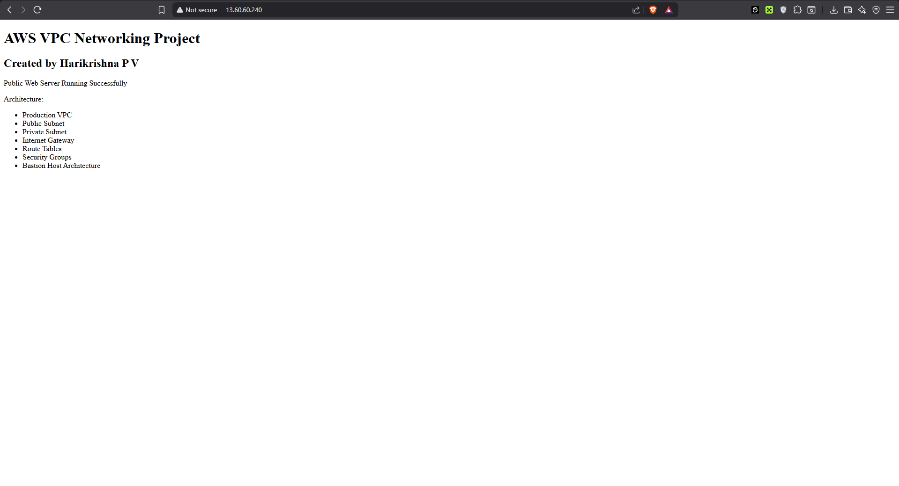

# AWS VPC Networking Project

## Project Overview

This project demonstrates the design and implementation of a secure AWS VPC architecture using public and private subnets.

## Architecture

## Architecture Diagram

## Technologies Used

- AWS VPC
- EC2
- Security Groups
- Route Tables
- Internet Gateway
- Linux (Amazon Linux 2023)
- Apache HTTP Server

## Architecture Components

- Production VPC (10.0.0.0/16)
- Public Subnet (10.0.1.0/24)
- Private Subnet (10.0.2.0/24)
- Internet Gateway
- Public Route Table
- Public Web Server
- Private Application Server
- Bastion Host Architecture

## Security Design

- Public server accessible from internet
- Private server has no public IP
- SSH allowed only through Bastion Host
- ICMP restricted using Security Groups

## Verification Performed

- SSH access verified
- Public to private communication verified
- Apache deployment verified
- Browser access verified

## Project Structure

## Key Screenshots

### Public Web Server

### Private Server Connectivity

### Website Verification

## Skills Demonstrated

- AWS VPC Design
- Subnet Planning
- CIDR Management
- Internet Gateway Configuration
- Route Table Management
- Security Group Configuration
- EC2 Deployment
- SSH Troubleshooting
- Linux Administration
- Apache Web Server Deployment
- Bastion Host Architecture

## Key Learnings

- Difference between public and private subnets
- How route tables control traffic flow
- Security Group best practices
- Bastion Host implementation
- Web server deployment on AWS
